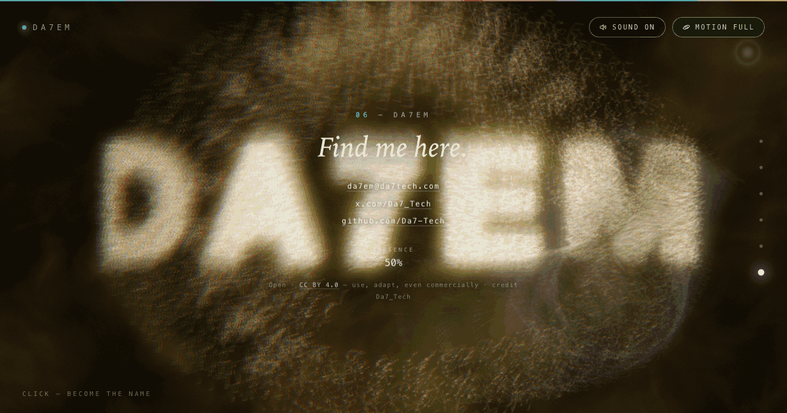

# Da7em — a living digital practice



**Live: <https://da7-tech.github.io/da7em/>**

Da7em is a machine: a single-file **WebGL2 + Web Audio organism**. One swarm of
particles begins as a signal, advises, evaluates, tests, leads, and finally
becomes the name. You scroll; it morphs. You move; it reacts. You leave it
alone; it dreams.

Everything you see and hear is computed at runtime inside **one HTML file**
(`index.html` — 1,902 lines, ~77 KiB) with **zero dependencies**:

- no libraries, no frameworks, no plugins
- no fetched fonts, no image files, no audio files
- no build step — open the file and it runs

**Open source under [CC BY 4.0](https://creativecommons.org/licenses/by/4.0/)** —
free to use, adapt and build on, even commercially, with one condition: credit
the source, Da7_Tech. See [License](#license).

---

## Contents

- [What this is](#what-this-is)
- [Open source under CC BY 4.0](#open-source-under-cc-by-40)
- [How it works](#how-it-works)
- [Zero dependencies, measured](#zero-dependencies-measured)
- [Particle counts — the honest numbers](#particle-counts--the-honest-numbers)
- [Running it](#running-it)
- [Verifying it](#verifying-it)
- [Deploying](#deploying)
- [Repository layout](#repository-layout)
- [License](#license)
- [Engine credit](#engine-credit)
- [Contact](#contact)

## What this is

A WebGL2 + Web Audio organism whose entire body is a particle swarm — up to
26,000 points simulated on the GPU. The piece unfolds in six chapters;
scrolling drives the morph between them, and one shared "seam" value
cross-fades physics, colors and sound together so image and audio never drift
apart.

| # | Chapter | Formation | What the visitor meets |
|---|---------|-----------|------------------------|
| 01 | SIGNAL | the word DA7EM, particle-typography | the name, stretched by the viewport |
| 02 | SERVICES | an iris (it sees the problem) | signals circling a decision |
| 03 | EVALUATE | a neuron with random-walk dendrites | a system fraying under scrutiny |
| 04 | TEST | six concentric heartbeat rings | the answer arriving as its opposite |
| 05 | LEAD | a two-armed memory spiral | direction, replayed and felt |
| 06 | DA7EM | DA7EM sunburst with 26 rays | contact links and the license line |

Interaction summary: the cursor repels and swirls particles like a fluid;
**taps** fire shockwaves — a tap is a press released within 12 px, so on touch
devices a scroll-drag never detonates the swarm (every scroll begins with a
pointer-down; feeding on pointer-down meant every scroll gesture exploded the
word — the single biggest mobile bug); sustained presses soften the push;
idling 4.5 s puts
the organism into a self-playing dream; chapter 05 replays your recent pointer
path as a light ghost that physically attracts the swarm; tapping in chapter
06 triggers a ~3.6 s transcendence (the spring is cut to 18 %, turbulence
spikes, the word explodes into nebula and reassembles). Keyboard: arrows and
PageUp/PageDown move between chapters. Sound and motion have independent,
honest toggles.

Editorial note: the copy is deliberately headings-only — each chapter keeps
only its heading and live readouts. That is a design decision, not missing
content.

## Open source under CC BY 4.0

The repository is public on purpose. The work is licensed
[CC BY 4.0](https://creativecommons.org/licenses/by/4.0/): share it, adapt it,
build products on it, use it commercially — **provided you credit the source:
Da7_Tech (da7tech.com)**, link the license, and indicate changes. The
canonical text is in [LICENSE](LICENSE); the short-form notice with the
suggested attribution line is in [NOTICE](NOTICE).

## How it works

One file, no build. The `<script>` is inline; the shaders are inline; the CSS
is inline. What follows is the actual machinery, with the numbers.

### The frame, in five stages

`loop()` runs five stages per frame, in order:

1. **Simulation** — `RASTERIZER_DISCARD` on, a points-only draw with a
   vertex shader (+ a dummy fragment shader writing zero) writes new
   `v_pos`/`v_vel` through **transform feedback** into the other buffer of the
   ping-pong pair. Nothing reaches the screen here.
2. **Trail** — a persistent full-resolution FBO that is never cleared. A black
   quad at alpha 0.26 fades the previous frame (0.34 in reduced-motion mode),
   then the blend switches to additive `ONE, ONE` and the freshly simulated
   particles are drawn in. The buffer *is* the memory of where light has been.
3. **Flesh** — one fullscreen quad of domain-warped FBM (below) into its own
   FBO at 0.34–0.5× screen resolution, bilinearly upsampled later.
4. **Bloom** — bright-pass from the trail buffer (Rec.709 luminance, soft knee
   at threshold 0.42) into a quarter-res target, then a separable 5-tap
   Gaussian (step 1.4 px), 1–2 iterations depending on quality tier.
5. **Composite** — straight to the default framebuffer: cursor lens
   refraction, breathing chromatic aberration, flesh + trail + bloom, the
   cursor orb, the memory ghost, vignette (0.42), film grain (±0.015),
   pre-wake dimming, then an **ACES** filmic tonemap (Narkowicz approximation,
   exposure 1.06, slight `pow(col, 0.94)` lift).

Intermediate targets: `trailFBO` (full res, linear, never cleared), `fleshFBO`
(0.34/0.5×), `bloomA`/`bloomB` (quarter res, ping-pong). All are `RGBA16F`
when `EXT_color_buffer_float` is available, `RGBA8` otherwise — the pipeline
degrades, it does not break. Fullscreen triangles are 3 vertices with no VBO
at all, positioned via `gl_VertexID`.

### The simulation — GPU-resident, deterministic

Allocation cap `MAXP = 26,000`; the number actually drawn per frame is the
quality tier's count (9,000 / 16,000 / 26,000). Formations are built at the
**live tier's** count, not the cap: a phone on tier 0 gets a complete
8,010-body word plus its 990-particle halo — never the first 9,000 points of a
26,000-point layout. At the top tier: 23,140 body
particles + 2,860 ambient "stardust". The split is exact by construction: the
last 11 % of indices are the halo — the same indices carry a seed ≥ 0.9, so the
shader's ambient physics and the CPU's ambient home-targets always agree on
precisely the same set (spring ×0.22, turbulence ×2.6, dimmed color — a faint
halo ring at radius 0.92–1.34 around the body).

State lives entirely in GPU buffers: `pos`/`vel` pairs (`DYNAMIC_COPY`, two of
each for ping-pong), one static seed buffer, and one home buffer per chapter.
Two VAOs and two transform-feedback objects; on chapter change only the home
attribute pointers are re-bound (`setHomeAttribs`) — the current and next
formations sit in attribute slots 3 and 4, and the shader mixes them.

Everything is deterministic via `mulberry32`: seeds with key 777, start
positions `1000+i`, velocities `5000+i`. Same formation, same first frame,
every session and across window resizes.

### Five forces per particle

Semi-implicit Euler (`vel += f·dt`, `pos += vel·dt`), then frame-rate-independent
damping `pow(0.885, dt·60)`, speed cap 3.4, and a micro-jitter that keeps the
body shimmering at rest:

1. **Spring to home** — where "home" itself is `mix(homeA, homeB, m)` and `m`
   is a per-particle staggered smoothstep of the global morph value. Particles
   ripple into the next shape in seeding order, not as one block.
2. **Curl-noise wander** — finite-difference curl (ε = 0.35) of a time-scrolled
   value-noise field, per-particle amplitude, deliberately kept well below the
   spring at rest or the formation would dissolve into fog.
3. **Cursor** — inside the cursor radius: fluid repulsion `(d/r)·k²` plus an
   orthogonal swirl `(−dy, dx)/r`; holding the button softens repulsion to 0.4.
4. **Memory-ghost attraction** — toward the replay point, with exponential
   falloff `exp(−|g|·3.4)`.
5. **Click shockwave** — radial impulse `exp(−|sd|·4.2)`.

### Particle typography

Glyphs become point clouds without any font asset: an offscreen 1600×800
canvas (2D context, `willReadFrequently`) draws the word at weight 900 — plus
a thick stroke (`lineWidth = px·0.085`) so letters stay fat even where the
900 weight is silently ignored — after `safeCanvasFont()` walks a fallback
stack (Canvas2D reverts a whole declaration to 10 px if it contains one
unknown family). `getImageData` filters alpha > 140, then uniform-steps over
the candidates with a `mulberry32(4242)` jitter of ±0.9 px per axis, emitting
exactly the requested count — never more, never a truncated glyph. Used twice:
chapter 01 (the word DA7EM) and chapter 06 (the sunburst core).

### The six formations

Each builder emits points; `padFormation` recycles them with ±0.012 jitter to
exactly the live tier's body count (23,140 at the top tier), then the home
buffer is assembled body + ambient halo. A mid-session tier switch rebuilds
and reseeds the swarm at the new density, so every formation stays complete at
any tier.

| Ch | Builder | Math |
|---|---------|------|
| 01 SIGNAL | `genText` | DA7EM glyph cloud, stretched `min(2.7, aspect·1.62)` |
| 02 SERVICES | `genIris` | solid ring 26 % at r = 0.60 · radial fibers 42 % in r ∈ [0.30, 0.40] · limbal ring 6 % at 0.42 · pupil disc 14 % (`r = √rng·0.10`) · 9 ciliary processes in r ∈ [0.63, 0.80] |
| 03 EVALUATE | `genNeuron` | soma disc 6 % (r ≤ 0.075) + 8 dendrites as random walks (step 0.0095, turn ±0.17 rad), branching at 5.5 % probability to depth 3, radius bound 0.88 |
| 04 TEST | `genRings` | 6 rings r = 0.15…0.80, weights [1.4, 1.5, 1.6, 1.6, 1.5, 1.4], radial jitter ±0.007 |
| 05 LEAD | `genSpiral` | core 12 % + two arms (44 % each): `r = 0.10 + t·0.78`, `t = rng^0.72`, angular spread tightening outward (0.55 → 0.25) |
| 06 DA7EM | `genBecome` | the word 76 % (82 % on lower tiers — legibility first) + 26 rays starting at r = 0.50 — deliberately outside the word belt so the letters own the center — + 5 % halo at 0.98 |

Chapter transitions: the last 16 % of each chapter is the seam window; its
smoothed value becomes `state.morph` (the per-particle stagger above) and
simultaneously cross-fades colors, spring, turbulence, bloom, vein intensity
and the audio mix. At the chapter boundary the homes re-bind and the new chord
arpeggiates.

### The flesh layer — domain warping

A double domain-warped FBM in the classic two-warp structure:

```
q = vec2(fbm(p·1.1 + t), fbm(p·1.1 − t + off));   // first warp
r = vec2(fbm(p·1.7 + 2.2q + …), fbm(p·1.7 + 2.2q + …)); // second warp by q
v = fbm(p·1.9 + 2.4r);
```

`fbm` is 4 octaves of value noise with a `mat2(0.8, −0.6, 0.6, 0.8)` rotation
between octaves, lacunarity 2.03, gain 0.5. Color: background ×1.1 +
`tintB·v²·0.65` + `tintA·v³·0.85`. On top: **capillaries** — a ridged
`|fbm − 0.5|` squeezed through `smoothstep(0.055, 0)` into thin, slowly
drifting threads; two Gaussian leans toward the cursor; and **heartbeat
ripples** `sin(d·16 − beatT·7.5)·exp(−d·1.9)·exp(−beatT·1.1)` — a ring that
expands from the cursor and fades with every beat (full strength in TEST,
0.12–0.2 elsewhere). The layer renders at 0.34–0.5× resolution because it is
low-frequency by design — the upsample is free quality.

### The audio — fully synthesized

No samples anywhere. `AudioEngine` builds everything from oscillators and one
noise buffer (2 s of `Math.random` white noise, looped):

- **Chain**: master gain → compressor (threshold −18 dB, ratio 6:1, knee
  18 dB) → destination. Start/stop ride 0.4 s time-constant fades — no clicks.
- **Drone**: two sines detuned by ×1.006 + 0.035 Hz, breathing, tuned to the
  chapter root.
- **Pad**: three saws (−6 / 0 / +6.2 cents) into a lowpass (Q = 7) sweeping
  150 → 150 + speed·2400 + turbulence·900 Hz — the pad "opens" with motion.
- **Air**: the noise buffer through a bandpass wandering 700 → 2800 Hz with
  turbulence, gain 0.012 → 0.11 — wind during storms.
- **Bells**: triangle + a sine partial at 2.01× with 1.9 s exponential decay,
  fed into a feedback delay (0.38 s, feedback 0.34, 2600 Hz damping lowpass).
- **One-shots**: kick (sine swept 150 → 42 Hz — the heartbeat), tick (1900 Hz
  square, 30 ms), whoosh (noise through a bandpass sweeping 180 → 2600 Hz),
  supernova (whoosh + four bells of the final chord + kick).
- **Harmony**: each chapter declares an explicit chord and root — A, B, F, D,
  E, A majors with roots 110 → 123 → 87 → 73 → 82 → 110 Hz. On chapter change
  the chord arpeggiates at 60 ms per note. Scroll velocity raises the heart
  BPM from 56 up to ~186. The automatic heartbeat's kick is audible only in
  TEST and during the transcendence; a click's kick sounds in every chapter
  (gain 0.25 — 0.85 in TEST, folded into the supernova in chapter 06).

Audio resolves on the first click (browser autoplay policy) and suspends when
the tab hides.

### Adaptive quality

| Tier | Particles | dpr | Flesh res | Bloom passes |
|------|-----------|-----|-----------|--------------|
| 0 | 9,000 | ×0.60 | 0.24 | 1 |
| 1 | 16,000 | ×0.85 | 0.50 | 1 |
| 2 | 26,000 | ×1.00 | 0.50 | 2 |

Initial pick: `?q=0..2` overrides everything; touch devices → 0;
`devicePixelRatio > 1.6` → 1; otherwise 2. `?freeze` locks the tier. Runtime:
frame times are linear-smoothed and fps measured over 0.5 s windows; every
2.2 s the controller steps down below 42 fps or up above 56 fps — with
hysteresis, and never above the initial tier (a weak device does not
overreach). Tier switches reallocate the FBOs (the trail resets with them),
and each event dims the visitor-facing "Signal" readout by 2 points. Effective
device pixel ratio is `min(devicePixelRatio, 2) × tier`.

### Dream and path memory

After 4.5 s of full-motion idleness the organism dreams: the cursor target is
replaced by a composite Lissajous path (`x = sin(t·0.33+1.3)·aspect·0.5 +
sin(t·0.71)·0.2`, `y = sin(t·0.21+4.2)·0.55 + cos(t·0.53)·0.15`) and every
cursor effect — repulsion, swirl, lens, flesh lean — acts on the phantom, so
the body genuinely plays alone. Any real input cancels it instantly.

While awake and moving, pointer samples at least 0.035 world units apart go
into a 700-point ring buffer (session only, nothing stored). In chapter 05,
after 1.4 s of rest with more than 12 points, the path replays at 65 points/s
as a ghost cursor that both renders and *attracts particles* — a replay you
can feel, not just see.

### Accessibility

Implemented and verified, not aspirational: skip-to-content link on focus;
`prefers-reduced-motion` calm mode from birth (turbulence ×0.05, no memory
recording, no beat glow, shorter trails, flesh time ×0.35, hidden cursor orb,
instant scrolling, CSS animations disabled) while sound deliberately remains
available; independent sound/motion toggles with `aria-pressed`; arrow-key and
PageUp/PageDown chapter navigation; canvas `aria-hidden` with
`role="presentation"`; chapter dots with `aria-current` and screen-reader
labels; a 1.5 px `focus-visible` outline; a `noscript` block with the poem;
and a no-WebGL2 fallback that keeps the words alive — if the light dies, the
text survives. In calm mode the final click answers with a soft chime instead
of the transcendence explosion. Pointer listeners are passive and
`touch-action: pan-y` keeps native scrolling intact.

### Determinism and frame-rate independence

Scroll restoration is forced off and every session opens on SIGNAL with the
same first frame. Resize is debounced 220 ms and formations are rebuilt only
when the aspect ratio changes by more than 12 % (or the quality tier switches).
On the lowest tier the points draw larger and the trails fade faster, so the
word stays legible and motion stays crisp on phones. Touch devices also skip
height-only resizes entirely — an iOS toolbar collapse mid-scroll reallocates
nothing — and trade the header's backdrop blur for opaque chips, since iOS
re-blurs the live canvas under them every frame.

Two deliberate tier-0 choices keep the full pipeline — sim, trails, flesh,
bloom, composite — running every frame with no mode switching:

- **LDR targets on tier 0** — the trail/flesh/bloom framebuffers fall back to
  `RGBA8` even when half-float rendering is available; linear-blending
  `RGBA16F` at full screen is one of the priciest things a mobile GPU does.
  The composite also drops chromatic aberration and film grain on this tier —
  both soften letter edges, so the word reads sharper without them.
- **No scroll hacks** — frame-skipping and pass-skipping "boost" modes were
  tried and removed: the site behaves identically whether the page is still
  or moving. Smoothness comes from a pipeline cheap enough to run outright,
  not from modes that come and go.

`dt` is clamped at 70 ms so a
background tab cannot catapult the physics, and below ~45 fps the GPU
simulation takes several small sub-steps per frame instead of one clamped
step — motion stays real-time down to ~14 fps rather than drifting into slow
motion. The trail fade is scaled by `dt` the same way, so trails persist for
the same wall-clock duration at any frame rate. All damping is exponent-based
(`expDamp`, `pow(0.885, dt·60)`) — behavior is identical from 30 to 144 Hz.

## Zero dependencies, measured

Claimed with a grep, not a vibe — audited against `index.html`:

- **one** `<script>` tag, no `src` attribute — all JavaScript and all shaders
  inline
- **zero** `import` / `require` / `fetch` / `XMLHttpRequest` / `new Image`
- **zero** `@font-face`, `@import` or `url()` in the CSS — the stacks are
  system fonts (`ui-monospace/SF Mono/Menlo…`, `"New York"/Iowan Old
  Style/Georgia…`, `ui-sans-serif/-apple-system…`)
- **no image is displayed anywhere** — even the glyph samples are drawn with
  system fonts on an offscreen canvas; the favicon is an inline SVG data URI
- **no audio files** — the noise buffer itself is filled with `Math.random`
- the only external references are the social meta tags (`og:image`,
  `twitter:image` — read by crawlers, never fetched by the page), the
  `canonical` hint, three outbound links — the chapter 06 license link
  (creativecommons.org), x.com/Da7_Tech and github.com/Da7-Tech — and a
  `mailto:`

`package.json` exists for the verification tooling below (playwright); none of
it is referenced by the page.

## Particle counts — the honest numbers

**Up to 26,000.** That is the top tier's draw count and the allocation cap —
not a constant. Touch devices start at 9,000; mid-range hardware at 16,000;
and the adaptive controller may step a session down if frame times demand it.

## Running it

Open `index.html` in any WebGL2 browser — `file://` works because nothing is
fetched. The page opens behind a veil: the body is scroll-locked and dimmed
until the first click, which resolves the audio context and full physics in
one gesture (this is also what satisfies browser autoplay policy). Scroll to
walk the chapters; `?q=0..2` pins a quality tier and `?freeze` disables
adaptation.

## Verifying it

Requires Node 20+ and playwright once: `npm install` and
`npx playwright install chromium` (headless Chrome renders WebGL via
SwiftShader). The harness is fail-closed: any console error or page exception
during a run makes it exit non-zero — a clean pass means a silent console.

| Script | What it does |
|--------|--------------|
| `npm run shot` | full set: all chapters, hover/click/transcendence/dream/memory states, reduced-motion, keyboard check; fails on any page error |
| `npm run quick` | the six chapters only — six screenshots; fails on any page error |
| `npm run telemetry` | 24 × 1 s frame-time samples with median / p95 / max, quality events, audio state |
| `npm run audit` | GPU detection + 45 s desktop and 30 s mobile soak; adaptive-quality events, heap growth, page errors; exits 0 only on a READY verdict |
| `npm run debug:layers` | per-target statistics (trail / flesh / bloom FBOs) via `__DA7EM__.stats()` + a trail-layer PNG dump |
| `npm run debug:formation` | plots formation[5] (the DA7EM sunburst) home points on a 2D canvas — isolates formation data from the render pipeline |
| `npm run og` | rebuilds `og-image.png` (1200×630) from the live chapter 6: averages 16 frames to cancel shader grain, median-cut quantizes, encodes an indexed PNG under a hard 300 KB budget |

The page also exposes `window.__DA7EM__` for live and automated inspection:
telemetry (fps, ms, quality, chapter, bpm, memory, replay, quality events)
plus probes — `snapHome(chIdx)` (snaps particles onto their homes),
`positions(sample)` (reads live GPU positions back from the transform-feedback
buffer), `displacement()` (RMS distance from formation — a formation-fidelity
metric), `snapshot()` / `stats(layer)` (reads intermediate render-target
pixels and computes the light ratio inside vs outside the glyph box).

## Deploying

**GitHub Pages — the target.** The sharing tags (`og:url`, `og:image`,
`twitter:image`, `canonical`) in `index.html` already point at
`https://da7-tech.github.io/da7em/`, so deployment is two steps:

1. Push this repository to `github.com/Da7-Tech/da7em` (branch `main`).
2. Repository **Settings → Pages → Source: Deploy from a branch →
   main /(root)**.

The site is live at `https://da7-tech.github.io/da7em/` about a minute later —
no build, no config. If chapter 6's look ever changes, refresh the social card
with `npm run og`.

**WordPress — secondary.** `wordpress/da7em-template.php` is a standalone page
template that emits the full site with no theme header/footer, kept for a
possible `da7tech.com` home on Hostinger. It is a byte-for-byte mirror of
`index.html`; only its four origin-bound meta tags point at
`https://da7tech.com/da7em/`. It is marked `linguist-vendored` so the
repository keeps its true face: one HTML file.

## Repository layout

| Path | Size | What it is |
|------|------|------------|
| `index.html` | 76.6 KiB | the entire site — markup, CSS, shaders, engine, audio |
| `LICENSE` | 18.2 KiB | CC BY 4.0 canonical text, verbatim from creativecommons.org |
| `NOTICE` | 0.6 KiB | attribution notice + suggested credit line |
| `package.json` | 0.7 KiB | dev-only verification tooling (never ships to the page) |
| `.gitattributes` | 0.2 KiB | marks the WordPress mirror as vendored for language stats |
| `og-image.png` | 261.1 KiB | 1200×630 social card, captured from the live chapter 6 |
| `tools/shot.mjs` | 8.0 KiB | screenshot + telemetry harness (fail-closed) |
| `tools/perf_audit.mjs` | 6.1 KiB | GPU detection + soak test |
| `tools/og_image.mjs` | 11.9 KiB | social-card capture + indexed-PNG encoder |
| `tools/layers_debug.mjs` | 3.2 KiB | per-render-target statistics (fail-closed) |
| `tools/formation_debug.mjs` | 3.3 KiB | formation point-cloud plotter (fail-closed) |
| `wordpress/da7em-template.php` | 76.8 KiB | standalone WordPress page template (secondary deploy) |

`screenshots/` (written by `npm run shot`) and `node_modules/` are local
artifacts, excluded by `.gitignore`.

## License

[CC BY 4.0](https://creativecommons.org/licenses/by/4.0/) — use, adapt and
build on this work for any purpose, even commercially, provided you credit
**Da7_Tech (da7tech.com)**, link the license, and indicate changes. Canonical
text: [LICENSE](LICENSE). Suggested attribution line:

```
Da7em by Da7_Tech (https://da7tech.com) — licensed CC BY 4.0
```

The license is also stated inside the page itself — the quiet line at the
bottom of chapter 06.

## Engine credit

Da7em runs on the **LUMEN** engine — *a living digital organism*, an earlier
work by the same author. The engine carries over intact: colors, physics,
formations logic and chords are identical. Two controls were reworked on
purpose for this site — sound now runs independently of the motion toggle,
and the motion toggle reflects its real state.

## Contact

- mail: [da7em@da7tech.com](mailto:da7em@da7tech.com)
- x: [x.com/Da7_Tech](https://x.com/Da7_Tech)
- github: [github.com/Da7-Tech](https://github.com/Da7-Tech)

---

© Da7_Tech — da7tech.com · Engine: LUMEN
